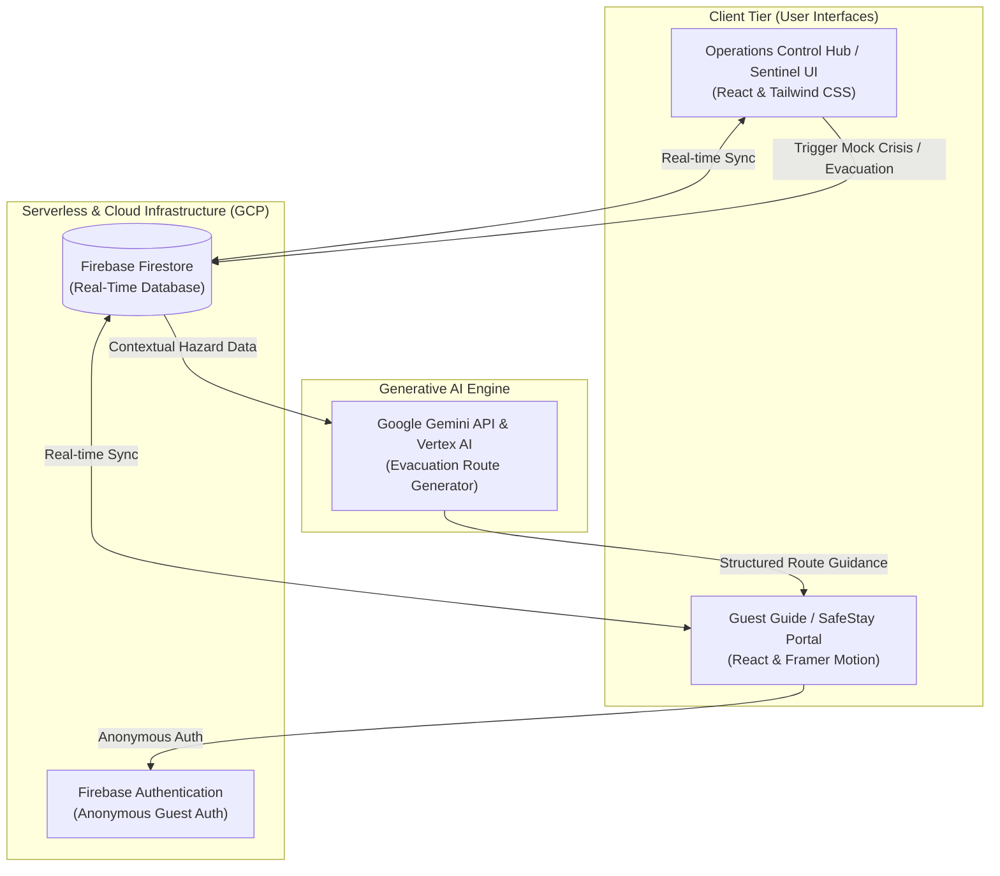
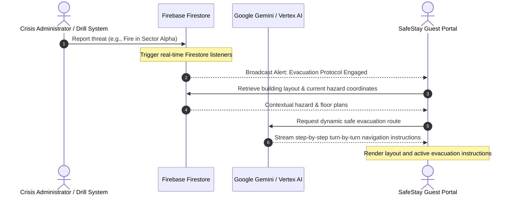
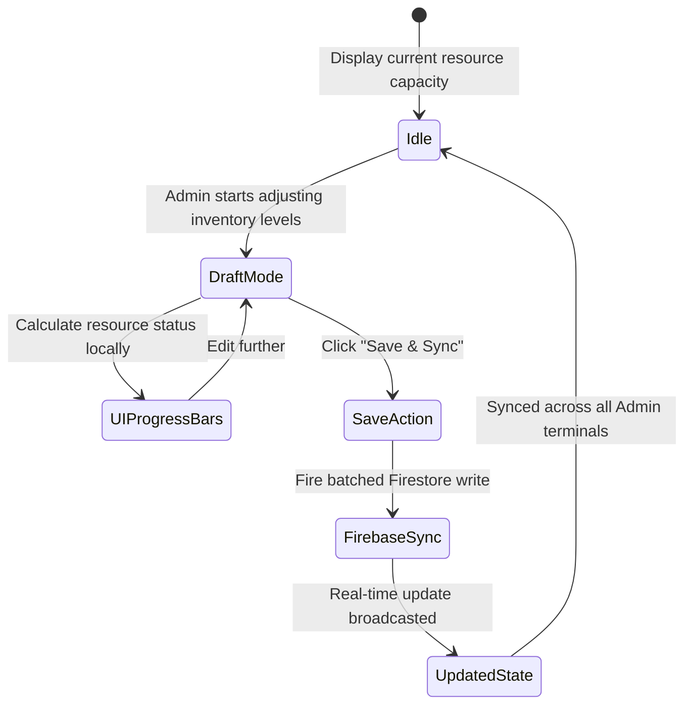

<div align="center">

</div>

# NexusResponse - Crisis Coordination System


[](https://hack2skill.com/event/build-with-ai?tab=solutionchallenge2026)

**NexusResponse** is a next-generation crisis coordination and emergency resource management system proudly built for the **[Build with AI — Google Solution Challenge 2026](https://hack2skill.com/event/build-with-ai?tab=solutionchallenge2026)** hosted on Hack2Skill. Powered by the expansive Google ecosystem—including **Google Gemini**, **Vertex AI**, **AI Studio**, and **Google Cloud Platform** (Firebase)—it provides real-time situational awareness, dynamic resource tracking, and automated guest guidance during critical events. Developed alongside Google DeepMind's **Antigravity** AI coding assistant, NexusResponse ensures rapid, intelligent, and coordinated crisis management.

## 🌟 Features

- **Real-Time Operational Dashboard**: Monitor facility status, active incidents, and core services at a glance with a high-fidelity "Sentinel" UI.
- **Resource Inventory Engine**: Floor-wise allocation tracking for essential supplies (linens, safety kits, medical, water) with direct Firebase synchronization.
- **Responder Unit Management**: Track deployment status, commander assignments, and active sectors for all security and emergency personnel.
- **Guest Guide Interface (SafeStay)**: A guest-facing portal providing interactive facility maps, SOS features, and dynamic evacuation routes during an emergency.
- **System Activity Logging**: Comprehensive transaction and event history for the NexusResponse Hub.
- **Visual Demo Mode**: Includes an immersive presentation mode simulating crisis coordination capabilities.
- **AI Integration**: Dynamically generated, context-aware evacuation routes powered by **Google Gemini** and fine-tuned via **Google AI Studio**.
- **Agentic Development**: Built and iterated rapidly with the help of **Antigravity**, Google DeepMind's advanced agentic AI coding assistant.
- **Enterprise-Grade AI Infrastructure**: Prepared for scale using **Google Vertex AI** for robust model deployment and operations.
- **Cloud-Native Backbone**: Fully integrated with **Google Cloud Platform (GCP)**, utilizing Firebase for real-time synchronization, auth, and secure data storage.

## 📋 Requirements

- Node.js (v18 or higher recommended)
- Firebase Project setup (Firestore, Auth)
- Google Gemini API Key
- Modern Web Browser

## 🚀 Quick Start

### 1. Installation

```bash
# Clone the repository
git clone https://github.com/Technomaniac143/NEXUS-SMART-RESPONSE.git
cd NEXUS-SMART-RESPONSE

# Install dependencies
npm install
```

### 2. Environment Configuration

Create a `.env.local` file in the root directory and add your keys:

```env
GEMINI_API_KEY=your_gemini_api_key_here
# Add Firebase config variables if using a separate backend instance
```

### 3. Run the Application

```bash
npm run dev
```

The application will automatically open or be available at `http://localhost:3000` (or the port specified by Vite).

## 📁 Project Structure

```
NEXUS-SMART-RESPONSE/
├── src/
│   ├── components/       # UI components (Maps, Dashboards, Modals)
│   ├── services/         # Firebase integration & AI services
│   ├── lib/              # Utility functions and standard helpers
│   ├── index.css         # Global Tailwind styles & Design System
│   └── App.tsx           # Main application entry point & routing
├── public/               # Static assets
├── .env.local            # Environment variables (not tracked in git)
├── package.json          # Node dependencies
└── README.md             # This file
```

## 🎯 Platform Capabilities

### Operations Control
- Incident Monitoring
- Live Threat Assessment
- Field Unit Deployment
- Real-time Operations Logs

### Resource Tracking
- Automated Supply Counting
- Floor-by-floor Allocation
- Quick-draft Updates & Syncing

### Guest Assistance
- Turn-by-turn Evacuation Guidance
- SOS Emergency Signaling
- Facility Exploration Map

## 🏆 Hackathon

NexusResponse was created as a submission for the **Build with AI — Google Solution Challenge 2026**, an initiative by Google and GDG (Google Developer Groups), hosted on **Hack2Skill**.

> 🔗 **Event Link**: [hack2skill.com/event/build-with-ai](https://hack2skill.com/event/build-with-ai?tab=solutionchallenge2026)

This project demonstrates:
- Real-world use of **Google Gemini** for AI-powered emergency response
- Integration with **Google Cloud Platform** and **Firebase** as the cloud backbone
- Prompt engineering and rapid prototyping via **Google AI Studio**
- Enterprise-grade AI scalability through **Google Vertex AI**
- Accelerated agentic development with **Google DeepMind's Antigravity**

## 🏗️ System Architecture

NexusResponse is built on a modern, decoupled cloud architecture utilizing Google Cloud Platform (GCP) and advanced Generative AI services. The diagram below illustrates the platform flow and component boundaries:



### Architectural Breakdown:
- **Client Tier**: Separate interfaces for administrators (Sentinel UI) and guests (SafeStay Portal).
- **Cloud Infrastructure**: Firebase handles real-time state synchronization, reducing latency to milliseconds, and manages quick anonymous sessions for guests in crisis zones.
- **Generative AI Engine**: Powered by Google Gemini and Google Cloud's Vertex AI to read building layouts, locate hazard zones, and dynamically compute safe evacuation pathways.

---

## 🔬 How It Works

### Crisis Detection Pipeline

1. **Threat Reported**: A critical threat (e.g. fire, structural damage) is manually entered or triggered via mock simulation.
2. **Database Logging**: The incident details are immediately written to Firebase Firestore.
3. **Admin Alerting**: The real-time listeners on the Sentinel Dashboard update all connected operations terminals instantly.
4. **Guest Broadcast**: Automated emergency signals are dispatched to all guest SafeStay instances.



### Evacuation Generation Pipeline

1. **Hazard Mapping**: The system identifies the hazard's exact location (floor, sector, room).
2. **Context Compilation**: Active threats, safe zones, and building coordinates are compiled.
3. **AI Generation**: The Google Gemini model processes the context and computes step-by-step navigation instructions avoiding hazard zones.
4. **Real-time Streaming**: Evacuation instructions are fed directly to affected users' SafeStay portals.

### Resource Inventory Pipeline

1. **Local Adjustments**: Admins adjust inventory levels (supplies, safety kits) in local draft mode.
2. **Capacity Assessment**: The UI recalculates progress bars and status indicators based on active thresholds.
3. **Batched Synchronization**: When saved, updates are packaged into a batched Firestore commit.
4. **Terminal Sync**: State is propagated to all open administrator dashboards.



## 📊 Understanding Results

### Incident Severity Levels

- 🔴 **Critical**: Immediate life-safety threat (e.g., active fire). Evacuation protocols engaged.
- 🟠 **High**: Significant operational disruption requiring urgent response.
- 🟡 **Medium**: Warning state. Situation under observation.
- 🟢 **Low**: Minor issue or resolved incident. Sky is clear.

### Resource Status

- **Nominal**: Resource levels are at or above 80% capacity.
- **Warning**: Resource levels are dropping.
- **Depleted**: Critical shortage in specific sectors requiring immediate restock.

## 🧪 Example Usage

### Running a Mock Drill

1. Navigate to the **Admin Operations** view.
2. Open the sidebar and click **Mock Crisis**.
3. The system will simulate a critical event (e.g., Fire in Sector Alpha).
4. Switch to the **Guest Guide View** to see the automated SOS and evacuation instructions appear in real-time.

## 🛠️ Technical Details

### Technologies Used

1. **Frontend Framework**: [React 19](https://react.dev/) + [TypeScript](https://www.typescriptlang.org/) + [Vite](https://vitejs.dev/)
2. **Styling & Animation**: [Tailwind CSS v4](https://tailwindcss.com/) + [Framer Motion](https://motion.dev/)
3. **Backend & Infrastructure**: [Firebase v12](https://firebase.google.com/) running on **Google Cloud Platform (GCP)**
4. **Generative AI & Tooling**: 
   - **Google Gemini** (via GenAI SDK)
   - **Google AI Studio** for rapid prompt engineering
   - **Google Vertex AI** for enterprise scalability
5. **Agentic Assistant**: Google DeepMind's **Antigravity**
6. **Data Visualization**: [Recharts](https://recharts.org/)

## 🔒 Privacy & Security

- **Role-Based Access**: Separation between Sentinel Admin views and Guest Guide views.
- **Anonymous Guest Auth**: Quick, secure check-in without storing permanent PII.
- **Real-Time Data Sync**: Encrypted database connections via Firebase.

## 🐛 Troubleshooting

### Firebase Connection Errors
Ensure your Firebase configuration in `firebaseService.ts` matches your active Firebase project settings and that your Firestore rules allow read/write access during development.

### Gemini API Not Responding
Verify your `GEMINI_API_KEY` in `.env.local` is correct and has not exceeded its quota.

### Port Conflicts
If port 3000 is taken, Vite will try the next available port. You can force a port by editing the `dev` script in `package.json`:
```json
"dev": "vite --port=3001"
```

## 📝 License

This project is licensed under the MIT License - see below for details.

```
MIT License

Copyright (c) 2026 NexusResponse

Permission is hereby granted, free of charge, to any person obtaining a copy
of this software and associated documentation files (the "Software"), to deal
in the Software without restriction, including without limitation the rights
to use, copy, modify, merge, publish, distribute, sublicense, and/or sell
copies of the Software, and to permit persons to whom the Software is
furnished to do so, subject to the following conditions:

The above copyright notice and this permission notice shall be included in all
copies or substantial portions of the Software.

THE SOFTWARE IS PROVIDED "AS IS", WITHOUT WARRANTY OF ANY KIND, EXPRESS OR
IMPLIED, INCLUDING BUT NOT LIMITED TO THE WARRANTIES OF MERCHANTABILITY,
FITNESS FOR A PARTICULAR PURPOSE AND NONINFRINGEMENT. IN NO EVENT SHALL THE
AUTHORS OR COPYRIGHT HOLDERS BE LIABLE FOR ANY CLAIM, DAMAGES OR OTHER
LIABILITY, WHETHER IN AN ACTION OF CONTRACT, TORT OR OTHERWISE, ARISING FROM,
OUT OF OR IN CONNECTION WITH THE SOFTWARE OR THE USE OR OTHER DEALINGS IN THE
SOFTWARE.
```

## ⚠️ Disclaimer

NexusResponse is an emergency coordination and management tool. While designed for reliability, it should be used to augment, not replace, existing physical emergency infrastructure and professional first responder judgment. 

**Use Cases:**
- ✅ Facility management and crisis coordination
- ✅ Real-time tracking of security personnel
- ✅ Emergency drills and simulations
- ✅ Assisting guest evacuations

**Not Recommended For:**
- ❌ Sole reliance during life-threatening situations without manual oversight
- ❌ Fully autonomous emergency dispatch without human verification

## 🤝 Contributing

Contributions are welcome! Areas for improvement:
- Enhanced AI response context using RAG
- Additional map integrations and 3D floor plans
- Expanded responder unit tracking (e.g., GPS integration)
- Mobile app deployments (React Native)

## 📧 Support

For issues, questions, or suggestions:
1. Check the troubleshooting section above
2. Review existing GitHub issues
3. Create a new issue with detailed information

## 🙏 Acknowledgments

- **GDG Hackathon 2026** organizers and community for providing the platform to build this solution
- Google DeepMind for the **Antigravity** agentic AI
- Google Cloud for providing the backbone via **Firebase**, **Vertex AI**, and **AI Studio**
- The React and Vite communities
- The developers of Tailwind CSS and Framer Motion

## 🔮 Future Enhancements

Planned features:
- Integration with smart building IoT sensors (smoke, motion)
- Push notifications for mobile web users
- Offline-first capabilities for low-connectivity crisis scenarios
- Advanced analytics dashboard with historical crisis data
- Multilingual support for the Guest Guide interface

---

**Built with ❤️ for a safer, more resilient world**

🛡️ NexusResponse - Vigilant Watch
